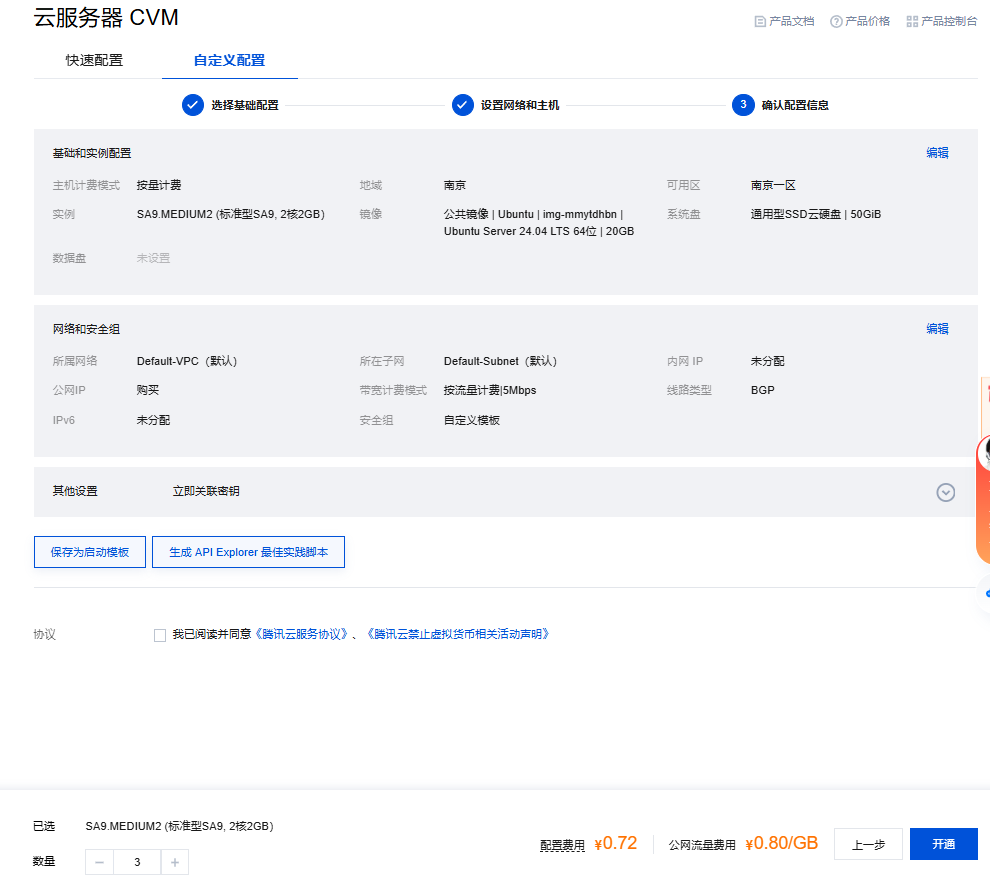
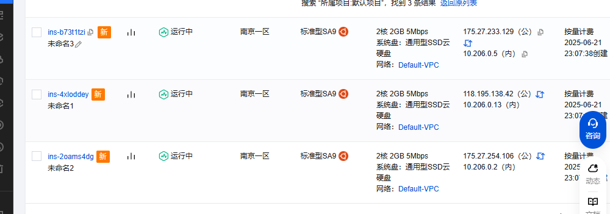
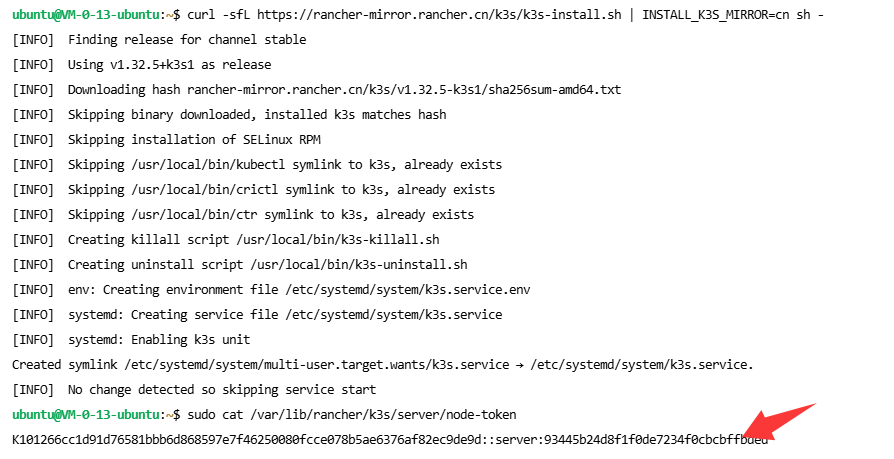
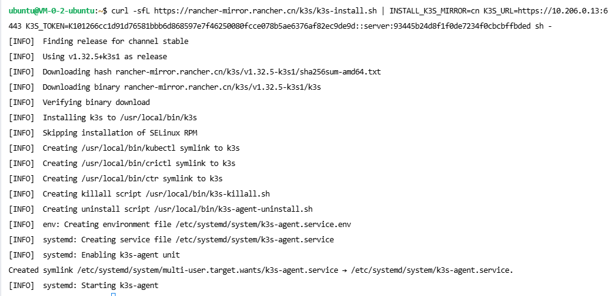
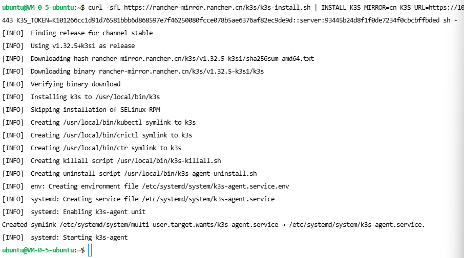

# 集群搭建指南：BiliTickerStorm

本指南以 **腾讯云服务器** 为例，介绍如何使用 **K3s** 快速搭建轻量级 Kubernetes 集群，以部署和运行 BiliTickerStorm 项目。

---

## 📌 说明

* 集群采用 [K3s](https://docs.k3s.io/zh/quick-start) 构建，因其资源占用小、易于部署，非常适合轻量场景。
* 本文默认你已经具备基本的 Linux 操作知识。

---

## 🚀 集群搭建步骤

### 1. 购买腾讯云服务器

1. 访问并购买云服务器：[腾讯云 CVM](https://buy.cloud.tencent.com/cvm)
2. 推荐配置：**2 核 CPU + 2GB 内存或以上**
3. 系统镜像：**Ubuntu 24.04 LTS (64位)**
4. 需分配**独立公网 IP**
5. 其他配置使用默认即可。

示例配置参考：



等待服务器创建完成：



---

### 2. 安装 K3s 集群

选择一台服务器作为 **主节点 (master)**，其余作为 **工作节点 (worker)**。

例如：

* 未命名1 → 主节点
* 未命名2、未命名3 → 工作节点

---

#### 2.1 主节点安装

1. 在主节点执行以下命令（将 `<IP>` 替换为主节点公网 IP）：

```bash
curl -sfL https://rancher-mirror.rancher.cn/k3s/k3s-install.sh | \
INSTALL_K3S_MIRROR=cn sh -s - server --tls-san <IP>
```

2. 查看并记录集群 token（供工作节点加入使用）：

```bash
sudo cat /var/lib/rancher/k3s/server/node-token
```

示例截图：



---

#### 2.2 工作节点安装

在每个工作节点上运行以下命令（替换为实际主节点的 IP 和 token）：

```bash
curl -sfL https://rancher-mirror.rancher.cn/k3s/k3s-install.sh | \
INSTALL_K3S_MIRROR=cn \
K3S_URL=https://<master-ip>:6443 \
K3S_TOKEN=<node-token> sh -
```

示例：

```bash
curl -sfL https://rancher-mirror.rancher.cn/k3s/k3s-install.sh | \
INSTALL_K3S_MIRROR=cn \
K3S_URL=https://10.206.0.13:6443 \
K3S_TOKEN=K101266...ffbded sh -
```

成功后：

* 未命名2 节点截图
  

* 未命名3 节点截图
  

---

### 3. 镜像加速配置（建议国内用户配置）

在所有节点（主节点 + 工作节点）上执行：

```bash
sudo mkdir -p /etc/rancher/k3s/

sudo tee /etc/rancher/k3s/registries.yaml > /dev/null << 'EOF'
mirrors:
  docker.io:
    endpoint:
      - "https://docker-0.unsee.tech"
  gcr.io:
    endpoint:
      - "https://gcr.m.daocloud.io"
  quay.io:
    endpoint:
      - "https://quay.m.daocloud.io"
  registry.k8s.io:
    endpoint:
      - "https://k8s.m.daocloud.io"
EOF
```

重启 K3s 服务以应用加速配置：

```bash
# 主节点
sudo systemctl restart k3s

# 工作节点
sudo systemctl restart k3s-agent
```

验证配置是否成功：

```bash
sudo ls /var/lib/rancher/k3s/agent/etc/containerd/certs.d
```

---

### 4. 查看集群状态（可选：使用 K8sLens）

1. 在主节点运行：

```bash
sudo kubectl config view --minify --raw
```

2. 修改其中内容：

将以下内容：

```yaml
server: https://127.0.0.1:6443
```

改为：

```yaml
server: https://<your_public_ip>:6443
```

3. 安装并使用 [K8sLens](https://k8slens.dev/download) 导入配置以图形化查看集群状态。

---

### 5. 安装 Helm（用于后续部署）

在主节点执行以下命令：

```bash
curl -fsSL -o get_helm.sh https://raw.githubusercontent.com/helm/helm/main/scripts/get-helm-3
chmod 700 get_helm.sh
./get_helm.sh
```

---

## ✅ 下一步

集群搭建完成后，请参考项目根目录下的 [`README.md`](../README.md) 进行后续部署（部署 BiliTickerStorm 服务等）。

---

## 🔗 参考文档

* [K3s 官方文档（中文）](https://docs.k3s.io/zh/)
* [K8sLens 文档](https://docs.k8slens.dev/getting-started/add-cluster/)
* [Helm 官方安装脚本](https://helm.sh/docs/intro/install/)

